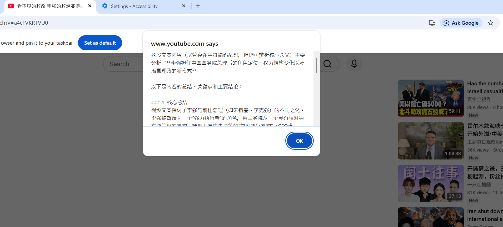
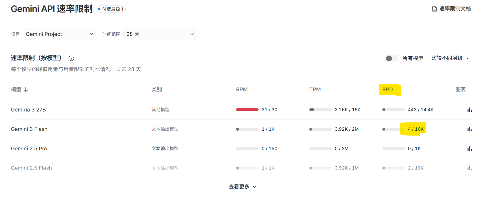

# YouTube 视频总结插件开发计划

这是一个从零开始构建 YouTube 视频总结插件的详细开发计划。按照以下步骤，逐步完成你的项目。

---

## 阶段一：MVP (最小可行产品) - 实现核心总结功能

**目标：** 制作一个可以总结**已有字幕**的 YouTube 视频的插件。

- [ ] **环境准备**
  - [X] 安装 [Node.js](https://nodejs.org/) (自带 npm)
  - [X] 安装 [Python](https://www.python.org/downloads/)
  - [X] 准备好你的 Google Gemini Pro API 密钥。

- [ ] **后端开发 (Node.js)**
  - [X] 在 `d:\2026fun_project\youtube-summarizer\` 目录下，初始化 Node.js 项目: `npm init -y`
  - [X] 安装后端所需依赖: `npm install express @google/generative-ai dotenv cors`
  （found 0 vulnerabilities意思是没有安全问题）
  （dotenv 把.env文件的配置信息加载到process.env中）
  （express是运行在Node.js上的轻量Web框架，用来快速搭建服务器/API，可用于启动一个Http服务器、定义路由接口、处理请求数据如解析JSON。中间件middleware是处理请求的函数，其中cors就是一个express的middleware，它用于处理跨域请求Cross-Origin Resource Sharing，故名cors,跨域就比如插件里的脚本向本地后端如localhost:3000发送请求，一般浏览器会拦截，除非允许）
  - [X] 创建 `server.js` 文件，并搭建基础的 Express 服务器。
  - [X] 创建 `.env` 文件，并将你的 Gemini API 密钥存入其中: `GEMINI_API_KEY=你的密钥`
  - [X] 在 `server.js` 中实现 `/summarize` API 端点，使其能够接收文本并调用 Gemini Pro API 返回总结。

- [ ] **字幕获取脚本 (Python)**
  - [X] 安装 Python 依赖: `pip install youtube-transcript-api`
  - [X] 创建 `get_transcript.py` 脚本，用于根据视频 ID 获取字幕。
  - [X] 在 `server.js` 中集成 `child_process` 模块，使其能够调用 `get_transcript.py` 脚本并获取其输出。

---- 在终端node server.js-----

- [X] **测试.py和server.js是否正常**
  - [X] 开新terminal并python get_transcript.py [视频id]看终端是否打出一个JSON {"transcript": null}，
  视频id 看网站https://www.youtube.com/watch?v=UFYut2QfXzw 这个v后面的就是id
    - [X] 如果视频不带字幕就是null
    - [X] 带字幕就不是
      https://www.youtube.com/watch?v=a4cFVKRTVU0
  - [X] 测试server.js
    `node .\server.js`
  
    确保node.js正在运行,另开一个新终端,请求一个带字幕的视频 

    在两个终端都应该受到消息，一个是JSON总结，一个是日志
      - [X] 带字幕的视频
        $json = '{"videoUrl":"https://www.youtube.com/watch?v=a4cFVKRTVU0"}'

        Invoke-RestMethod -Method Post -Uri http://localhost:3000/summarize -Body $json -ContentType "application/json"
      - [X] 不带字幕的视频
        $json = '{"videoUrl":"https://www.youtube.com/watch?v=UFYut2QfXzw"}'

- [X] **前端开发 (Chrome 插件)**
  - [X] 创建 `manifest.json` 文件，定义插件的基本信息、权限和脚本。
  - [X] 创建 `background.js` 文件，作为插件的后台服务工作者。
  - [ ] ~~创建 `content.js` 文件~~ (已通过 `executeScript` 的 `func` 参数简化，不再需要独立文件)。
  - [X] 在 `background.js` 中编写逻辑：当用户点击插件图标时，获取当前页面 URL。
  - [X] 在 `background.js` 中编写逻辑：调用后端的 `/summarize` API。
  - [X] 在 `background.js` 中编写逻辑：接收到后端的总结或错误后，通过 `chrome.scripting.executeScript` 将结果注入页面。
  - [X] 在注入的函数中，使用 `alert()` 在页面上显示结果。
  
- [X] **测试与联调**
  - [X] 在本地启动后端服务器: `node server.js`
  - [X] 在 Chrome 浏览器中加载解压的插件。
        打开 Chrome，地址栏输入 chrome://extensions。
        打开右上角的“开发者模式”。
        点击“加载已解压的扩展程序”，然后选择你的 d:\2026fun_project\youtube-summarizer 文件夹。
  - [X] 打开一个带字幕的 YouTube 视频，点击插件图标，验证是否能成功获取并显示总结。
    
---

## 阶段二：增强功能 - 支持无字幕视频 (Whisper)

**目标：** 当视频没有字幕时，利用 Gemini 多模态能力自动提取音频，转写成文字，然后再总结。

- [ ] **准备工作**
  - [X] 确保 Gemini API 密钥已在 `.env` 文件中。
  - [X] 确保 gemini 这个api的project已经升级到tier 1
    
  - [X] **重要：** `npm install @ffmpeg-installer/ffmpeg @ffprobe-installer/ffprobe  uuid`确保安装 ffmpeg 

- [ ] **后端增强**
  - [X] 安装音频处理库: `npm install yt-dlp-exec fluent-ffmpeg `  
  - 
  - [X] 修改 `/summarize` 端点逻辑：当 `get_transcript.py` 返回 `null` 时，执行新的音频转写流程。
  - [X] 实现音频下载逻辑：使用 `ytdl-core` 将视频的音频流保存为临时文件。
  - [X] 实现音频切块逻辑：使用 `fluent-ffmpeg` 将长音频切成多个小块。
  - [X] 实现并发转写逻辑：使用 `Promise.all` 将所有音频块并发发送给 Gemini 1.5 Flash 进行转写。
  - [X] 将拼接后的完整文本交给 Gemini 进行总结。

- [X] **测试**
  - [X] 找一个确定没有字幕的 YouTube 视频。
  - [X] 点击插件图标，验证是否能成功完成“下载音频 -> 转写 -> 总结”的完整流程。

---

## 阶段三：UI改进 - 时间轴字幕

- [ ] **爬取改成字幕带时间轴**
  - [ ] 有字幕的视频。
  - [ ] 无字幕的视频。
  - [ ] 。

---

## 阶段三：高级功能 - 批量处理与整合

**目标：** 支持一次性处理多个视频，并生成一个总的摘要。

- [ ] **前端 UI 升级**
  - [ ] 创建 `popup.html` 和 `popup.js` 文件。
  - [ ] 修改 `manifest.json`，将 `action` 的 `default_popup` 指向 `popup.html`。
  - [ ] 在 `popup.html` 中创建一个文本域（`<textarea>`）让用户粘贴多个 YouTube 链接，并添加一个“开始批量总结”按钮。

- [ ] **后端开发 (批量处理)**
  - [ ] 创建一个新的 API 端点，例如 `/batch-summarize`，用于接收一个 URL 数组。
  - [ ] 实现异步处理逻辑：后端接收到请求后，对每个 URL 循环执行“获取字幕/转写 -> 总结”的流程。
  - [ ] （可选，但推荐）实现任务状态查询机制，以便前端可以轮询进度。
  - [ ] 当所有视频都总结完毕后，将所有单个总结拼接起来，再次调用 Gemini Pro 生成一个“元摘要”（meta-summary）。
  - [ ] 将最终的元摘要和所有单个摘要返回给前端。

- [ ] **前后端联调**
  - [ ] 在 `popup.js` 中编写逻辑，调用 `/batch-summarize` API。
  - [ ] 在 `popup.html` 中设计界面，用于显示处理进度和最终的总结结果。

---

## 阶段四：部署与优化

- [ ] **后端部署**
  - [ ] 选择一个云平台（如 Vercel, Render, Heroku 等免费或付费方案）。
  - [ ] 将你的 Node.js 后端应用部署到云端。
  - [ ] 在 `background.js` 和 `popup.js` 中，将 `fetch` 的 URL 从 `http://localhost:3000` 修改为你的线上后端地址。

- [ ] **优化与发布**
  - [ ] 美化插件的 UI/UX，使其更易用、更美观。
  - [ ] 进行充分的错误处理和边界情况测试。
  - [ ] （可选）遵循 Chrome Web Store 的指南，打包并发布你的插件。